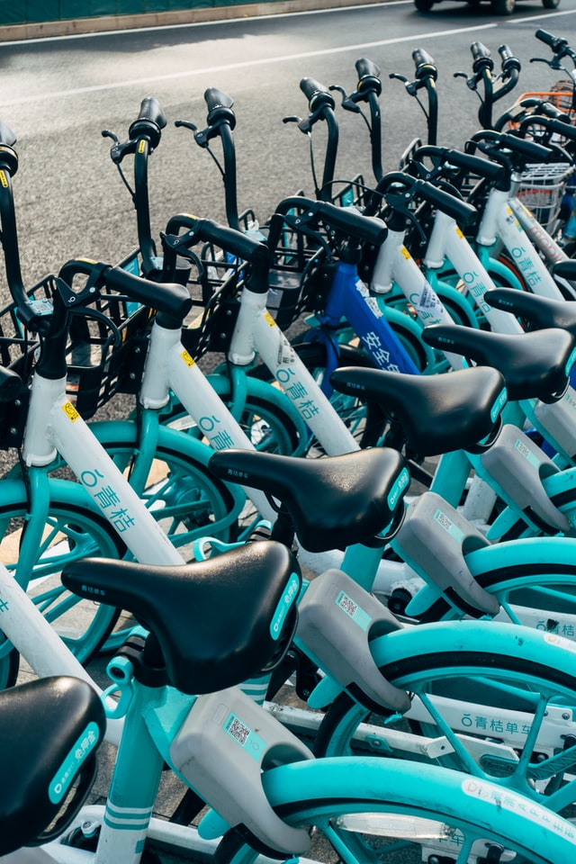

# Kyle 'Big Data' Hendricks
*An Aspiring Data Analyst | Kaggle Novice*

# Education
* Honors (Psychology, *University of the Western Cape*, 2007- 2013
* Data Analytics Certificate (Data analytics), *Coursera*, 2022

# [Project 1: Bellabeat_Case Study](https://www.kaggle.com/kyle007hendricks/bellabeat-caser)

Photo collected from Bellabeats' Facebook page .

This Case study identify trends and insights into how non-Bellabeat smart devices users use their smart fitness devices, and use this to provide quality recommendations for how Bellabeat can improve their marketing strategy.

* **R libraries used:** tidyverse, ggplot2, lubridate tidyr, skimr, readr, ggpubr, ggrepel, here, dplyr, ggeasy,plotrix
* **Notebook:** CSV files (18 only 3 used in the analysis) daily_sleep,daily_activity & intensity_hours
* **Output:** Bellabeat Case

# [Project 2: Cyclistic Case Study](https://www.kaggle.com/kyle007hendricks/cyclistic-case1)
 

Photo by <a href="https://unsplash.com/@markuswinkler?utm_source=unsplash&utm_medium=referral&utm_content=creditCopyText">Markus Winkler</a> on <a href="https://unsplash.com/s/photos/bike-sharing-service?utm_source=unsplash&utm_medium=referral&utm_content=creditCopyText">Unsplash</a>
  
  
This Case Study identifies trends and insights into how existing casual riders and members use the Cyclistic services differently, and use this to provide quality recommendations for how Cyclistic can design a new marketing strategy to convert existing casual riders into annual members.

* **R libraries used:** tidyverse, ggplot2, lubridate, tidyr, skimr, readr, here, dplyr, ggeasy, sqldf
* **Notebook:** Fictional dataset of 12 CSV files from months (February 2021- Junuary 2022)
* **Output:** Cyclistic Case Study

# [Project 2: Amazon Books Case Study](https://www.kaggle.com/kyle007hendricks/amazon-books-case)
 

Photo by <a href="https://unsplash.com/@fahrulazmi?utm_source=unsplash&utm_medium=referral&utm_content=creditCopyText">Fahrul Azmi</a> on <a href="https://unsplash.com/s/photos/amazon-books?utm_source=unsplash&utm_medium=referral&utm_content=creditCopyText">Unsplash</a>
  
  
This project looks at the top 50 books from 2009-2019 including 550 books &, identifies trends into how certain authors influence positive ratings(whether or not certain authors are more popular amongst raters), whether or not price is a big indicator in terms of the book choices people make and whether people prefer non-fiction or fiction books.

* **R libraries used:** tidyverse, ggplot2, lubridate, tidyr, skimr, readr, here, dplyr, ggeasy, sqldf
* **Notebook:** 1 CSV file on the top 50 books from years 2009-2019
* **Output:** Amazon Books Case Study

  
